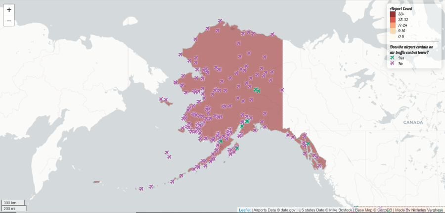

##Airports within the US

[This project](https://nickv23.github.io/US_airports/) is focused on mapping all
of the airports within the US along with additional information. Clicking upon an
airport icon will show the name of the airport as well as the state it is located
in. The color of the airport icon signifies whether that airport has an air traffic
control tower or not. The colors of the states signify the number of airports that
said state contains, and the levels of magnitude can be found in the legend on the
right. The source for the airports data can be found [here](https://catalog.data.gov/dataset/usgs-small-scale-dataset-airports-of-the-united-states-201207-shapefile). The source for the states data
can be found [here](https://bost.ocks.org/mike/).

Below are images taken from the project of the continental United States, Alaska,
Hawaii, and Puerto Rico.

